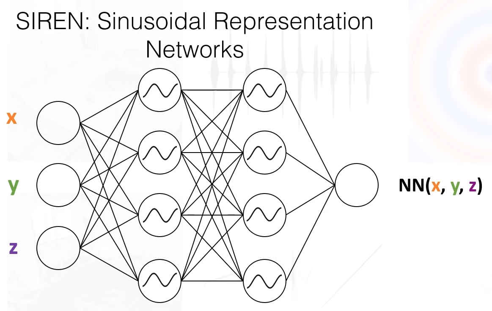

# CT_projections_compression-DL-BIA-project-
This repository contains code implementation of different compression method which we have implemented and compared on CT projections dataset as a part of our joint DL and BIA project at Skoltech.

# Project description
In this project we implemented, compare and combine several compression ideas.
We work with raw projections (images caught by CT detector), which then are used for human body reconstruction. Our goal is to compress projection storage.

We have implemented the following methods:
1) VQ-VAE image compression applied to each image
2) Deep video compression
3) ConvLSTM frame prediction
4) MLP neural image representation
5) Using less number of projections, but getting the same quality on reconstruction (UNet architecture)

Related code could be found in corresponding folders.

## Dataset

We worked with CT projections dataset from https://wiki.cancerimagingarchive.net/pages/viewpage.action?pageId=52758026. Library for data and metadata extraction is discribed in First_sight_on_dataset.jpynb file. 

Algorythm for reconstruction is implemented using TIGRE library https://tigre.readthedocs.io/en/latest/
## MLP neural image representation
We use SIREN model (https://arxiv.org/abs/2006.09661) to compress image data.
Here is the model architecture:

The code to reproduce the model is contained in the `MLP (Siren)` folder.
This model results in very high compression rate, however the metrics are not that high.
Here are the results of compressing approximately 1GB of data:
Size(Mb)| Model type    | PSNR    | SSIM    | HaarPSI | VSI     | Loss(mse)
:-----  | :-----------  | :-----: | :-----: | :-----: | :-----: | :-----:
0.75 Mb | siren         | 22.07   | 0.82    | 0.61    | 0.94    | 0.03
1.3 Mb  | siren         | 22.07   | 0.82    | 0.62    | 0.93    | 0.03
3.05 Mb | siren         | 22.01   | 0.81    | 0.6     | 0.94    | 0.05
4 Mb    | siren         | 22.12   | 0.8     | 0.63    | 0.94    | 0.03
4 Mb    | siren_cascade | 21.87   | 0.82    | 0.63    | 0.94    | 0.03
19 Mb   | siren         | 21.97   | 0.84    | 0.6     | 0.94    | 0.03
